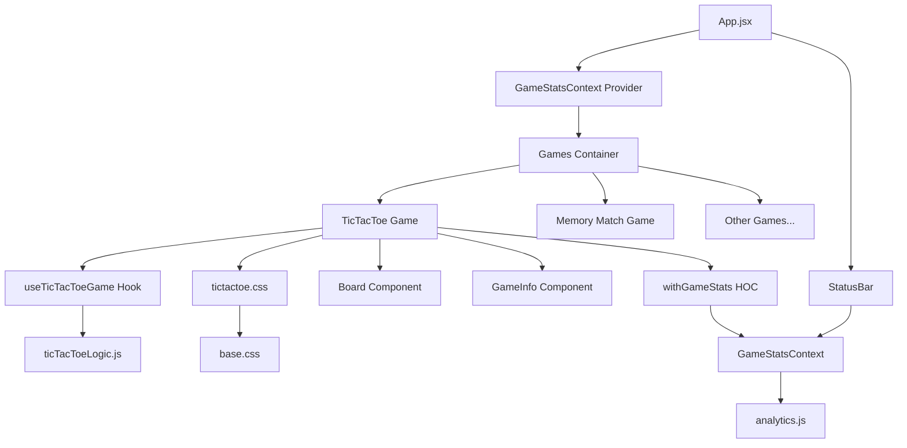
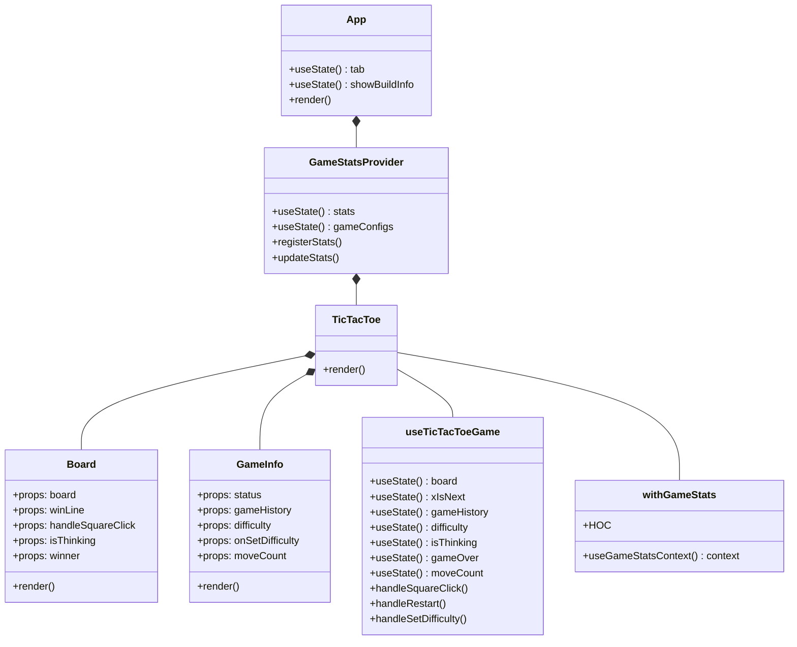
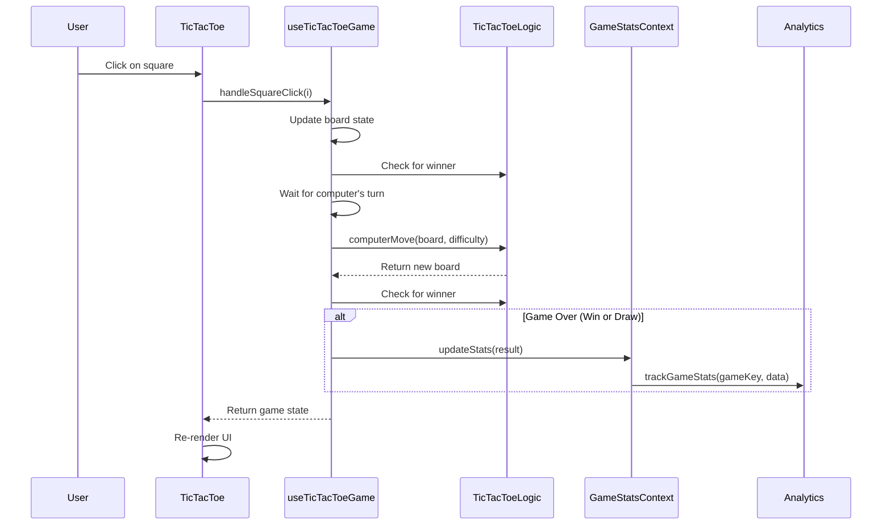

# Application Architecture

This document outlines the architecture of the React-based gaming application, focusing on the Tic Tac Toe game component and how it integrates with the overall system.

## Architecture Overview

The application follows a component-based architecture pattern with React hooks and context for state management. It employs several design patterns including:

1. **Component Composition Pattern**: UI is built from composable, reusable components
2. **Custom Hooks Pattern**: Logic is extracted into reusable hooks
3. **Higher-Order Component Pattern**: Components are enhanced with additional capabilities
4. **Context Provider Pattern**: Global state is managed through React Context
5. **State Management Pattern**: Component state is managed through hooks

## System Components Flowchart

## Component Hierarchy

## Data Flow

## File Structure

The application follows a structured organization:

- **Components**: UI building blocks (`/src/components/`)
- **Hooks**: Reusable logic (`/src/hooks/`)
- **Context**: Global state management (`/src/context/`)
- **Styles**: CSS files organized by component and game (`/src/styles/`)
- **Utils**: Utility functions (`/src/utils/`)
- **Game Logic**: Game-specific logic files (e.g., `ticTacToeLogic.js`)

## State Management

The application uses a combination of local component state (via React hooks) and global application state (via Context API):

1. **Local State**: Component-specific state managed with useState and useReducer hooks
2. **Global State**: Game statistics and shared data managed through Context API
3. **Custom Hooks**: Extraction of reusable stateful logic into custom hooks

## Design Patterns Used

1. **Component Composition**: Building complex UIs from simpler components
2. **Higher-Order Components**: withGameStats for adding statistics capabilities
3. **Custom Hooks**: Logic extraction into reusable hooks (useTicTacToeGame)
4. **Provider Pattern**: GameStatsProvider for global state
5. **Container/Presentational Pattern**: Separation of logic and presentation
6. **Memoization**: React.memo for performance optimization
7. **Observer Pattern**: Analytics tracking
8. **Prop Drilling Alternative**: Context API for deep component hierarchies
